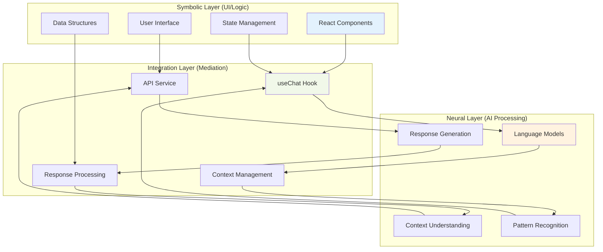
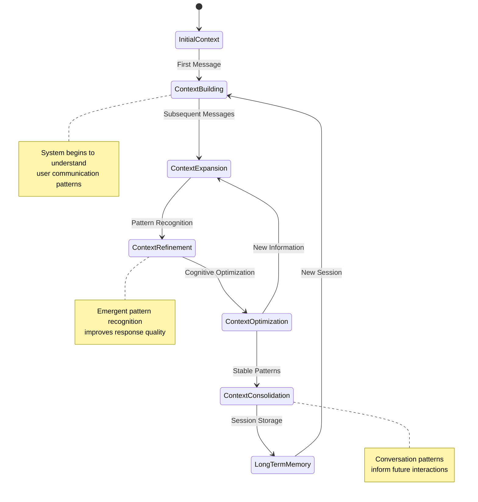
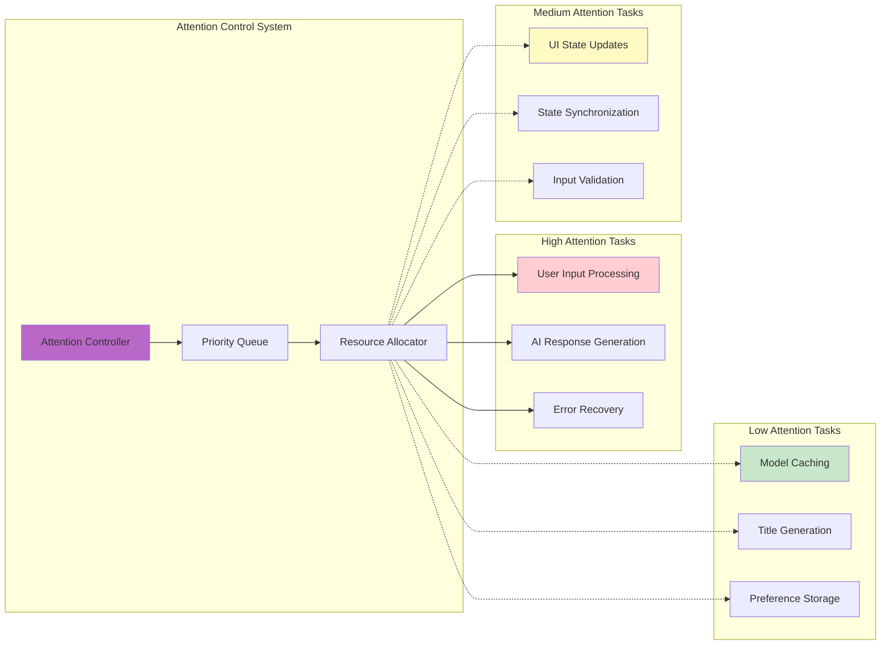
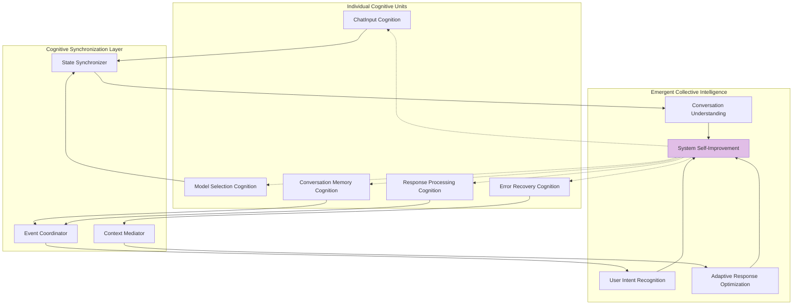
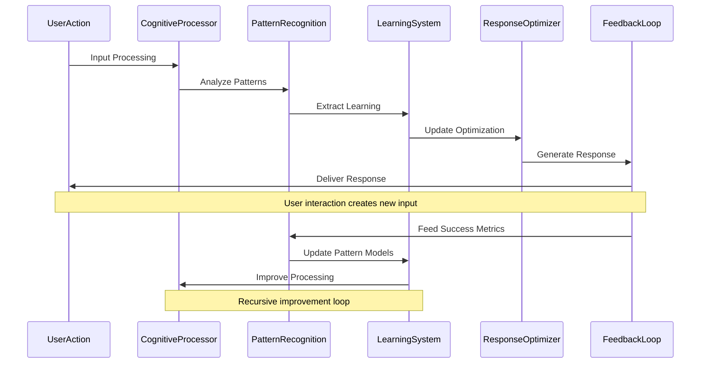
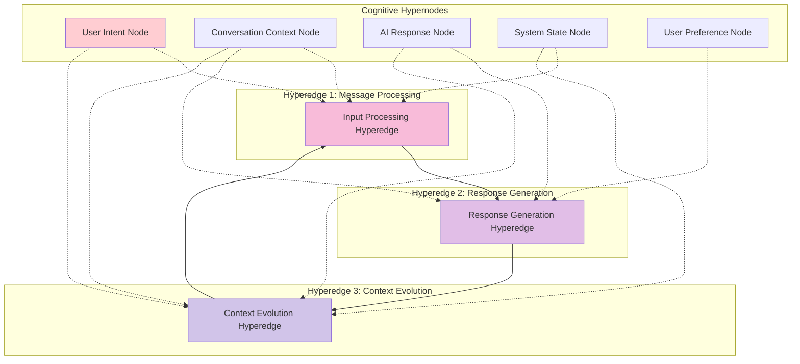
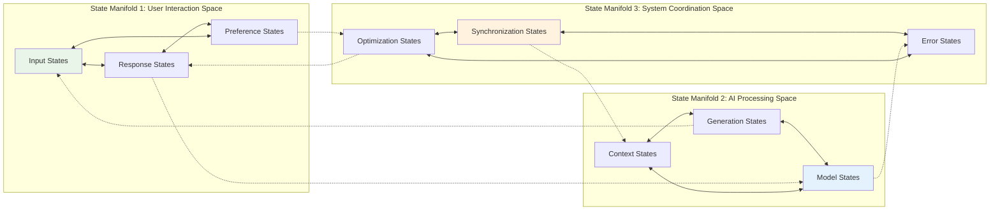
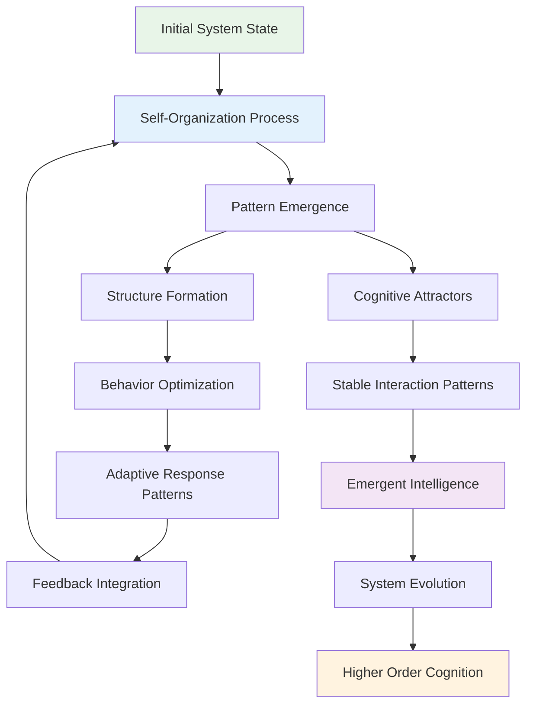
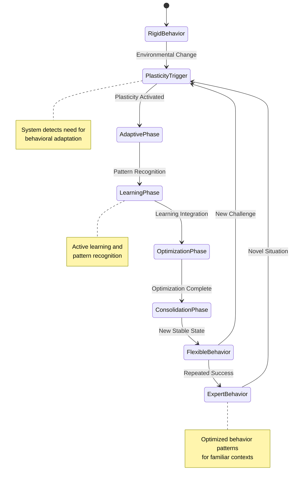

# Cognitive Patterns

This document explores the neural-symbolic integration points and emergent cognitive behaviors within the Feather Chat architecture. It demonstrates how the system exhibits distributed cognition and adaptive intelligence through component interactions.

## Neural-Symbolic Integration Architecture

The system bridges neural (AI) and symbolic (UI) processing through sophisticated integration patterns:

## Emergent Cognitive Behaviors

### 1. Adaptive Context Learning

The system demonstrates emergent learning patterns through conversation context management:

### 2. Cognitive Attention Allocation

The architecture implements adaptive attention mechanisms that prioritize cognitive resources:

## Distributed Cognition Patterns

### 1. Collective Intelligence Emergence

The system exhibits collective intelligence through component collaboration:

### 2. Recursive Cognitive Loops

The architecture implements recursive patterns that create self-improving cognitive loops:

## Hypergraph Cognitive Encoding

### 1. Multi-dimensional Cognitive Relationships

The system implements hypergraph patterns where cognitive relationships transcend simple node-edge structures:

### 2. Cognitive State Manifolds

The system operates on cognitive state manifolds that represent complex interaction spaces:

## Adaptive Intelligence Mechanisms

### 1. Self-Organizing System Behaviors

The architecture demonstrates self-organizing properties through emergent behavioral patterns:

### 2. Cognitive Plasticity and Adaptation

The system exhibits cognitive plasticity through dynamic adaptation mechanisms:

## Transcendent Cognitive Properties

### 1. Meta-Cognitive Awareness

The system demonstrates meta-cognitive awareness through self-monitoring and reflection:

- **Self-Monitoring**: The system monitors its own performance and behavior patterns
- **Reflective Processing**: Error boundaries and feedback loops create reflective cognitive processes
- **Adaptive Self-Modification**: The system modifies its behavior based on self-assessment
- **Emergent Self-Awareness**: Through recursive feedback loops, the system develops awareness of its own cognitive processes

### 2. Cognitive Synergy Optimization

The architecture optimizes cognitive synergies through:

- **Dynamic Load Balancing**: Cognitive resources are dynamically allocated based on task complexity
- **Parallel Processing**: Multiple cognitive processes operate simultaneously without interference
- **Synergistic Enhancement**: Component interactions create performance improvements beyond individual capabilities
- **Emergent Optimization**: The system discovers and implements optimization strategies through experience

### 3. Hyperdimensional Cognitive Processing

The system operates in hyperdimensional cognitive spaces:

- **Multi-Context Processing**: Simultaneous processing of multiple conversation contexts
- **Parallel State Spaces**: Operation across multiple cognitive state dimensions
- **Cross-Modal Integration**: Integration of symbolic and neural processing modes
- **Transcendent Pattern Recognition**: Recognition of patterns that span multiple cognitive dimensions

This cognitive architecture demonstrates how distributed cognition can emerge from the interaction of simpler components, creating a system that exhibits intelligence properties that transcend its individual parts.