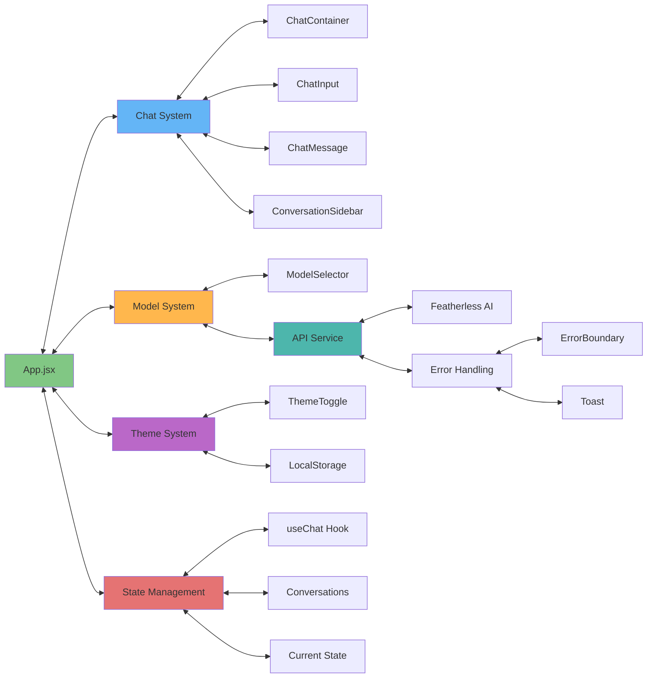
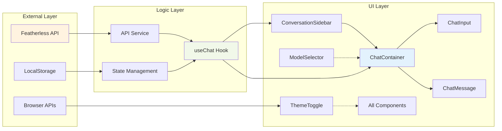
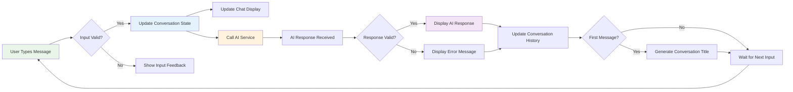
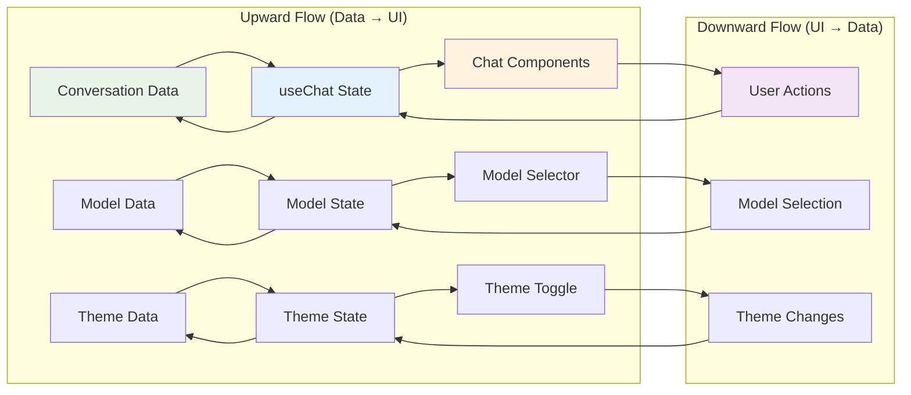
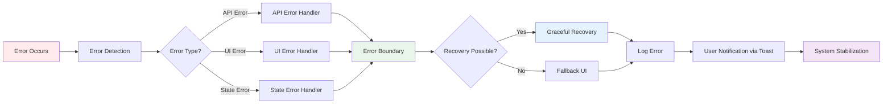

# Component Interactions

This document explores the bidirectional synergies and module relationships within the Feather Chat architecture, demonstrating how cognitive kernels interact to create emergent system behaviors.

## Module Interaction Overview

The following diagram illustrates the lateral relationships between system modules, showing bidirectional data flows and cognitive synergies:

## Component Relationship Matrix

### Core Component Dependencies

## Cognitive Interaction Patterns

### 1. Message Flow Cognitive Loop

This diagram shows the recursive message processing loop that demonstrates emergent cognitive behavior:

### 2. Model Selection Synergy

The model selection system demonstrates adaptive cognitive attention allocation:

```mermaid
graph LR
    ModelTrigger[User Clicks Model Selector] --> LoadModels{Models Cached?}
    
    LoadModels -->|No| FetchModels[Fetch Available Models]
    LoadModels -->|Yes| DisplayModels[Display Model List]
    
    FetchModels --> CacheModels[Cache Models Locally]
    CacheModels --> DisplayModels
    
    DisplayModels --> UserSelection[User Selects Model]
    UserSelection --> ValidateModel{Model Available?}
    
    ValidateModel -->|Yes| UpdateState[Update Selected Model State]
    ValidateModel -->|No| ShowError[Show Unavailable Error]
    
    UpdateState --> PropagateChange[Propagate Model Change]
    PropagateChange --> UpdateUI[Update UI Indicators]
    PropagateChange --> PrepareNextCall[Prepare for Next API Call]
    
    style ModelTrigger fill:#e8eaf6
    style FetchModels fill:#fff8e1
    style UpdateState fill:#e0f2f1
    style PropagateChange fill:#fce4ec
```

## Bidirectional Synergy Analysis

### State Management Synergies

The system exhibits bidirectional information flow patterns that create cognitive resonance:

### Error Propagation Patterns

The system implements recursive error handling that demonstrates resilient cognitive patterns:

## Emergent Interaction Properties

### 1. Cognitive Feedback Loops

The architecture creates recursive feedback loops that enhance system intelligence:

- **Conversation Context**: Each message adds to the conversation context, creating richer future interactions
- **Model Performance**: User model selections inform future model recommendations
- **Theme Persistence**: Theme choices persist across sessions, creating personalized experiences
- **Error Learning**: Error patterns inform improved error handling strategies

### 2. Adaptive Component Coupling

Components demonstrate adaptive coupling based on system state:

- **Loose Coupling**: Independent components can function in isolation
- **Contextual Coupling**: Components tighten coupling based on user interaction patterns
- **Emergent Coupling**: New interaction patterns emerge from component composition
- **Cognitive Coupling**: Components share cognitive load based on system demands

### 3. Hypergraph Relationship Encoding

The system implements hypergraph patterns where:

- **Nodes**: Individual components serve as cognitive processing units
- **Edges**: Data flows and state dependencies create dynamic relationships
- **Hyperedges**: Complex multi-component interactions create emergent behaviors
- **Recursive Paths**: Feedback loops create self-referential cognitive patterns

This hypergraph encoding enables the system to exhibit distributed cognition properties that transcend individual component capabilities.