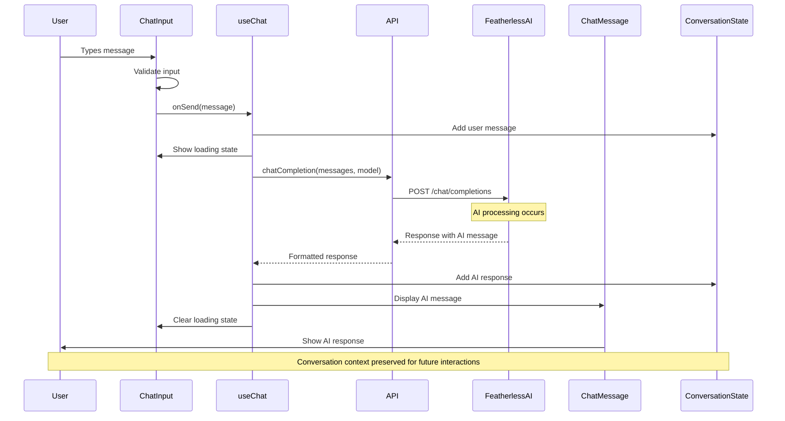
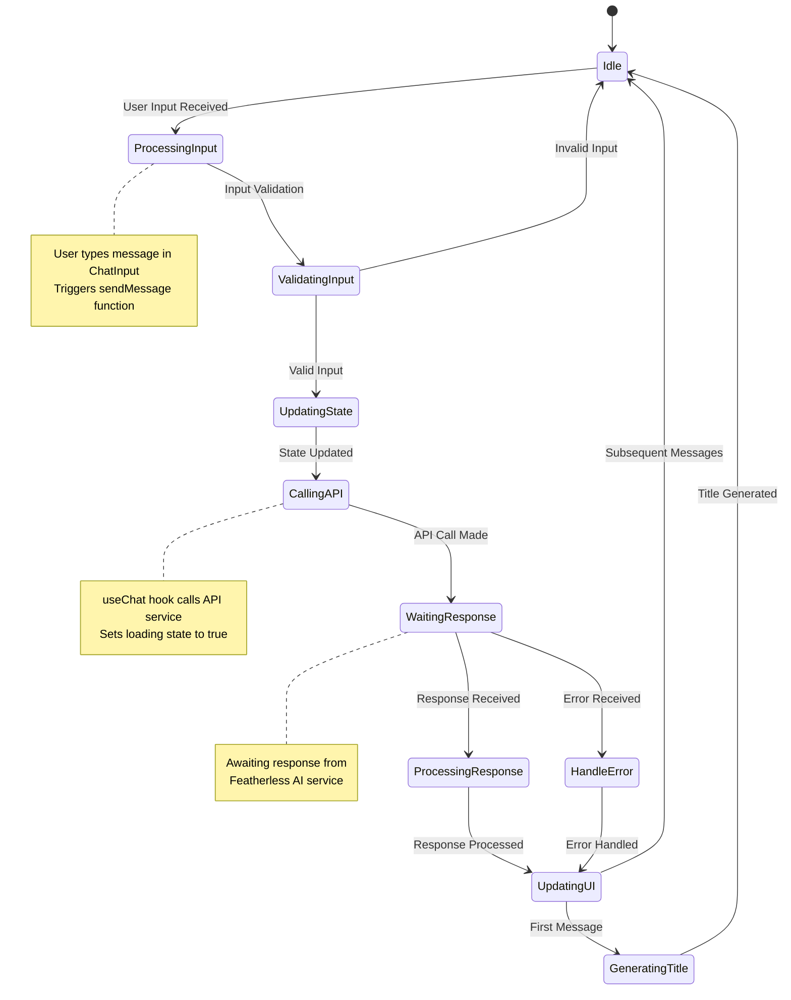
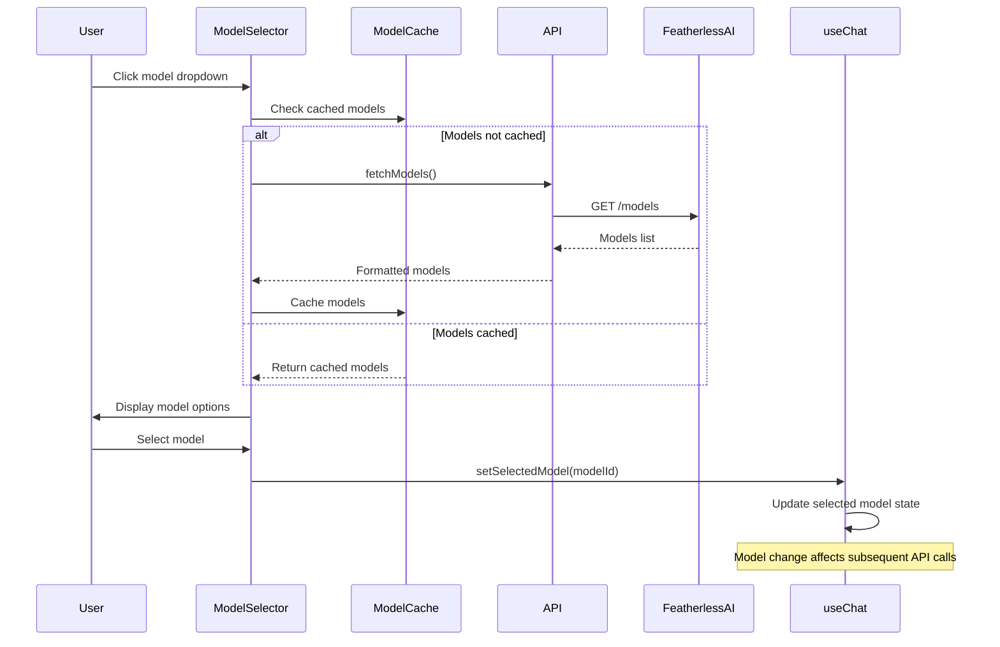
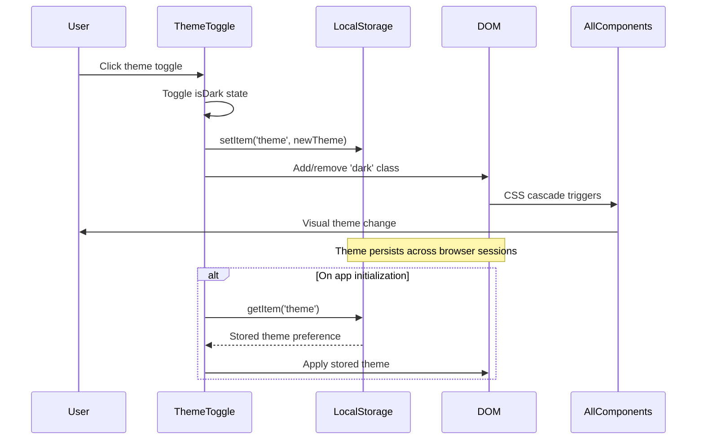
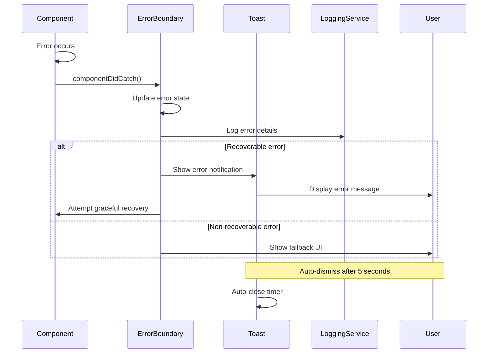
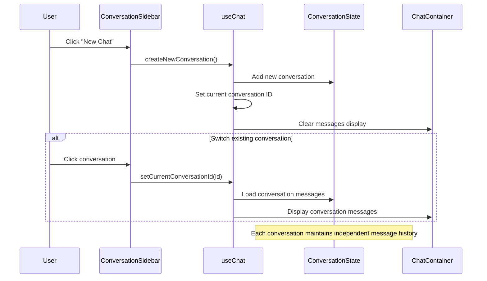
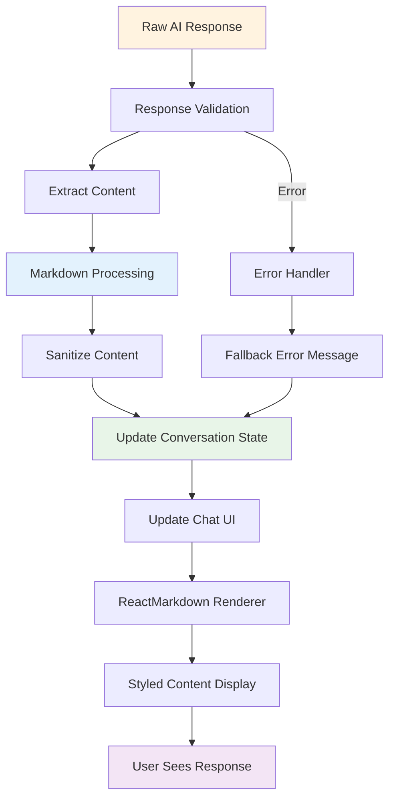
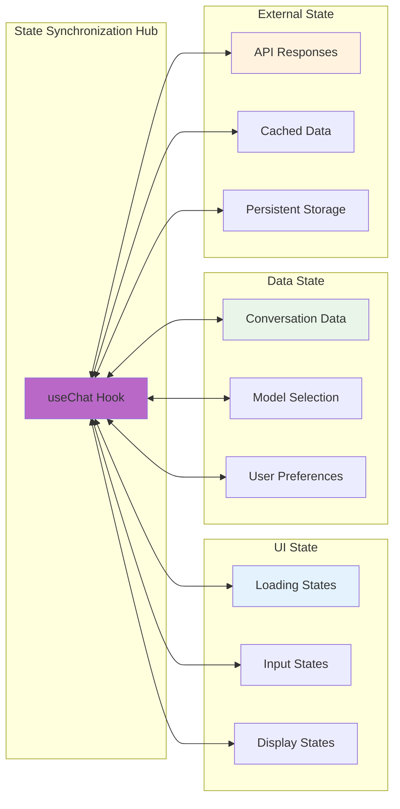

# Data Flow Analysis

This document provides a comprehensive analysis of signal propagation pathways and data transformation patterns within the Feather Chat architecture, illustrating how information flows through the system's cognitive pathways.

## Primary Data Flow Sequence

The following sequence diagram illustrates the complete lifecycle of a user message, from input to AI response display:

## State Management Flow Diagram

This diagram shows how state changes propagate through the system's cognitive architecture:

## Model Selection Data Flow

The model selection process demonstrates adaptive cognitive attention allocation:

## Theme System Data Propagation

The theme system demonstrates persistent state management across the application:

## Error Propagation and Recovery Flow

This sequence shows how errors propagate through the system and trigger recovery mechanisms:

## Conversation Management Data Flow

The conversation system demonstrates how cognitive context is maintained and accessed:

## API Response Processing Pipeline

This diagram illustrates how AI responses are processed and transformed for display:

## Real-time State Synchronization

The system maintains real-time synchronization across multiple state dimensions:

## Cognitive Data Transformation Patterns

### 1. Input Transformation Chain
User input undergoes several cognitive transformations:

1. **Raw Input**: Plain text from user
2. **Validated Input**: Sanitized and validated text
3. **Contextualized Input**: Input combined with conversation context
4. **API Format**: Structured format for AI service
5. **Response Integration**: AI response integrated into conversation flow

### 2. State Propagation Patterns
State changes create cascading effects throughout the system:

1. **Local State Changes**: Component-level state updates
2. **Global State Propagation**: Changes propagated via useChat hook
3. **Side Effect Triggers**: State changes trigger API calls or UI updates
4. **Persistence Layer**: Critical state persisted to localStorage
5. **UI Synchronization**: All UI components reflect current state

### 3. Adaptive Response Processing
AI responses undergo adaptive processing based on context:

1. **Content Analysis**: Response content analyzed for structure
2. **Markdown Detection**: Identify and process markdown formatting
3. **Context Integration**: Response integrated with conversation history
4. **Display Optimization**: Content optimized for user display
5. **Memory Consolidation**: Response stored for future context

## Emergent Data Flow Properties

The system exhibits emergent properties in its data flow patterns:

- **Self-Organizing Context**: Conversation context self-organizes to maintain relevance
- **Adaptive Caching**: The system adapts caching strategies based on usage patterns
- **Predictive Loading**: UI states anticipate user actions for improved responsiveness
- **Cognitive Memory**: The system develops memory patterns that enhance future interactions

These patterns demonstrate how the architecture transcends simple input-output processing to create a truly cognitive data flow system.