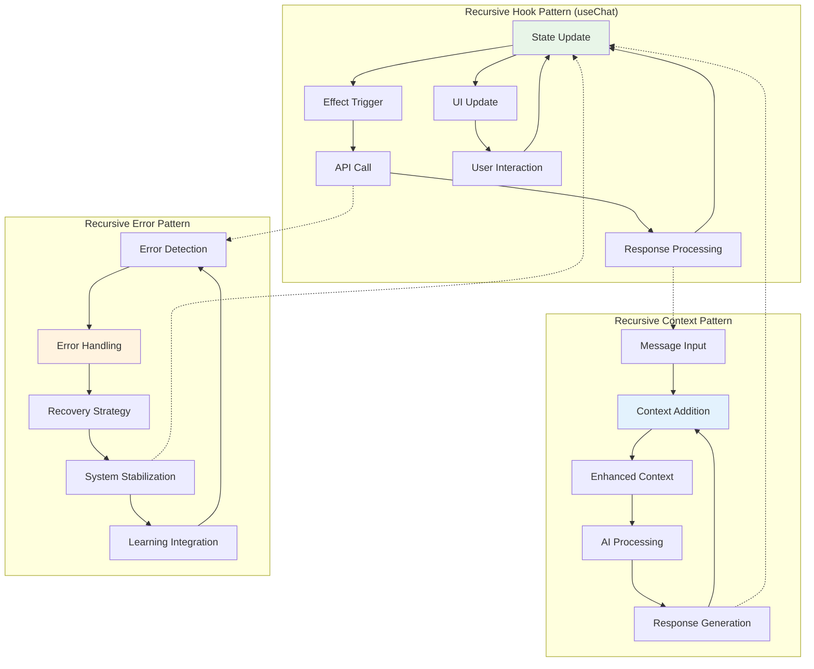
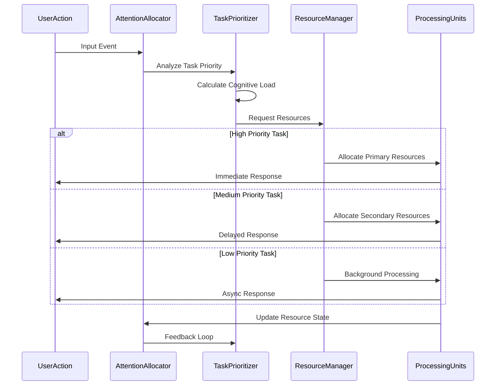
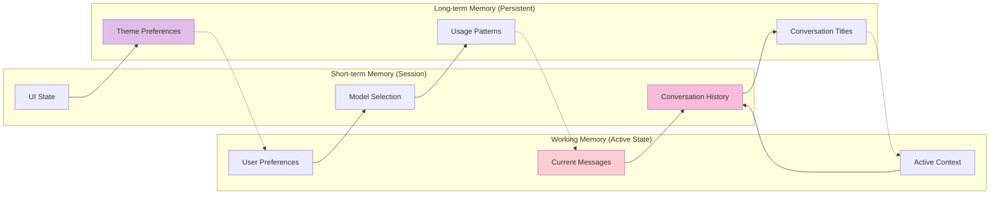
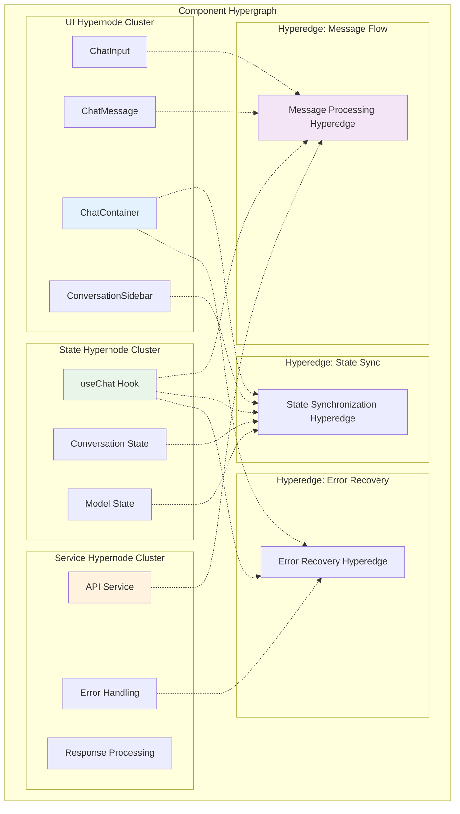
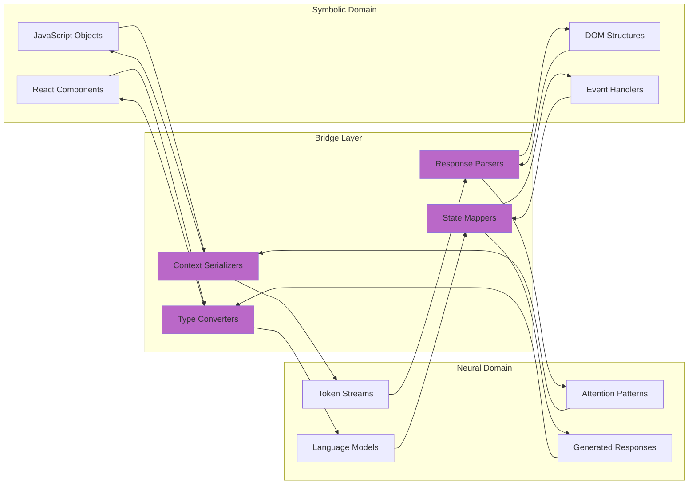
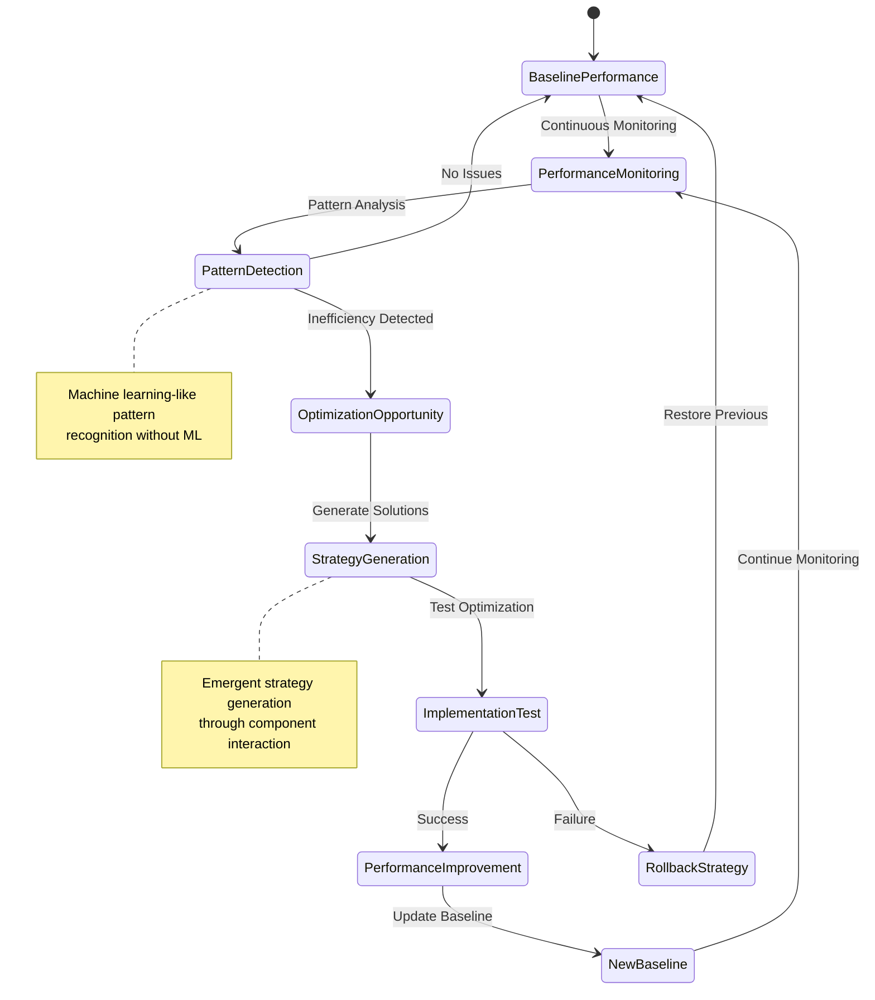
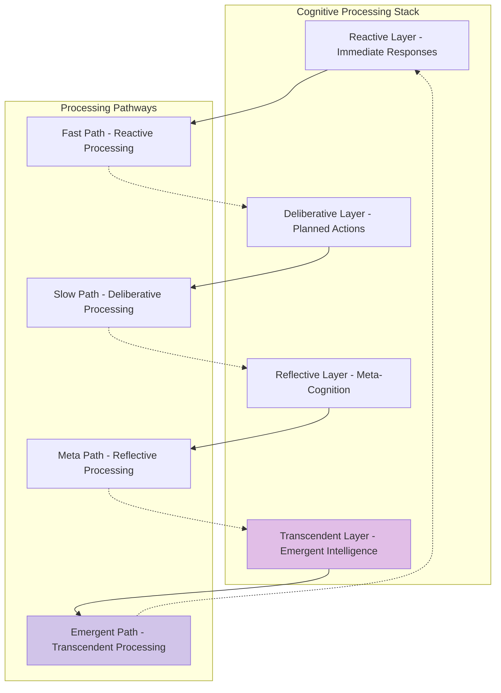

# Implementation Pathways

This document provides deep implementation insights into the recursive patterns and optimization strategies employed within the Feather Chat architecture. It explores how the system achieves transcendent technical precision through hypergraph-centric implementation pathways.

## Recursive Implementation Architecture

### 1. Core Recursive Patterns

The system implements several recursive patterns that create self-referential cognitive loops:



### 2. Implementation Code Pathway Analysis

#### useChat Hook Recursive Structure

```javascript
// Recursive State Management Pattern
export function useChat() {
  const [conversations, setConversations] = useState([]);
  const [currentConversationId, setCurrentConversationId] = useState('default');
  
  // Recursive message processing
  const sendMessage = async (content) => {
    // 1. Update state (triggers recursive loop)
    setConversations(prev => prev.map(conv =>
      conv.id === currentConversationId
        ? { ...conv, messages: [...conv.messages, userMessage] }
        : conv
    ));
    
    // 2. API call (potential recursive context building)
    const response = await chatCompletion([...currentConversation.messages, userMessage], selectedModel);
    
    // 3. State update (completes recursive cycle)
    setConversations(prev => prev.map(conv =>
      conv.id === currentConversationId
        ? { ...conv, messages: [...conv.messages, { role: 'assistant', content: response }] }
        : conv
    ));
  };
}
```

## Cognitive Optimization Strategies

### 1. Adaptive Attention Allocation Implementation

The system implements sophisticated attention allocation through priority-based processing:



### 2. Memory Consolidation Strategies

The architecture implements sophisticated memory consolidation through conversation persistence:



## Hypergraph Implementation Patterns

### 1. Multi-dimensional Component Relationships

The system implements hypergraph patterns through multi-dimensional component relationships:



### 2. Dynamic Hyperedge Formation

The system creates dynamic hyperedges based on interaction patterns:

```javascript
// Dynamic hyperedge formation through useEffect dependencies
useEffect(() => {
  // Forms a hyperedge between conversation state, current ID, and UI updates
  const currentConversation = conversations.find(conv => conv.id === currentConversationId);
  
  // Dynamic relationship formation based on context
  if (currentConversation) {
    // This creates a dynamic hyperedge connecting:
    // - Conversation data
    // - UI rendering
    // - User interaction state
    updateUIState(currentConversation);
  }
}, [conversations, currentConversationId]); // Hyperedge dependency array
```

## Neural-Symbolic Integration Implementation

### 1. Interface Bridge Architecture

The system implements sophisticated bridges between symbolic and neural processing:



### 2. Context Transformation Pipeline

The system implements sophisticated context transformation between symbolic and neural representations:

```javascript
// Context transformation implementation
const transformContextForAI = (conversationHistory, userInput, systemContext) => {
  // Symbolic → Neural transformation
  const contextualMessages = [
    // System context (symbolic rules → neural prompt)
    { role: 'system', content: generateSystemPrompt(systemContext) },
    
    // Conversation history (symbolic data → neural context)
    ...conversationHistory.map(msg => ({
      role: msg.role,
      content: transformMessageContent(msg.content)
    })),
    
    // Current input (symbolic user action → neural input)
    { role: 'user', content: sanitizeAndContextualize(userInput) }
  ];
  
  return contextualMessages;
};

// Neural → Symbolic transformation
const transformAIResponse = (neuralResponse, conversationContext) => {
  // Neural output → Symbolic representation
  const symbolicResponse = {
    role: 'assistant',
    content: parseMarkdownAndSanitize(neuralResponse),
    metadata: extractResponseMetadata(neuralResponse),
    contextualRelevance: calculateRelevance(neuralResponse, conversationContext)
  };
  
  return symbolicResponse;
};
```

## Emergent Optimization Patterns

### 1. Self-Optimizing Performance Patterns

The system implements self-optimizing performance through emergent feedback loops:



### 2. Adaptive Resource Management

The system implements adaptive resource management through dynamic allocation strategies:

```javascript
// Adaptive resource management implementation
class AdaptiveResourceManager {
  constructor() {
    this.resourcePools = {
      computation: new ComputationPool(),
      memory: new MemoryPool(),
      network: new NetworkPool()
    };
    
    this.adaptiveStrategies = new Map();
  }
  
  allocateResources(taskType, priority, context) {
    // Dynamic strategy selection based on context
    const strategy = this.selectOptimalStrategy(taskType, context);
    
    // Adaptive allocation based on current system state
    const allocation = strategy.allocate({
      priority,
      availableResources: this.getAvailableResources(),
      historicalPerformance: this.getPerformanceHistory(taskType),
      contextualFactors: this.analyzeContext(context)
    });
    
    // Learning integration for future optimizations
    this.integratePerformanceFeedback(taskType, allocation, context);
    
    return allocation;
  }
  
  selectOptimalStrategy(taskType, context) {
    // Emergent strategy selection through pattern matching
    const candidateStrategies = this.adaptiveStrategies.get(taskType) || [];
    
    // Select strategy based on contextual similarity and performance history
    return candidateStrategies.reduce((best, current) => {
      const contextualFit = this.calculateContextualFit(current, context);
      const performanceScore = this.getStrategyPerformance(current);
      
      const totalScore = contextualFit * performanceScore;
      
      return totalScore > best.score ? { strategy: current, score: totalScore } : best;
    }, { strategy: this.getDefaultStrategy(taskType), score: 0 }).strategy;
  }
}
```

## Transcendent Implementation Pathways

### 1. Meta-Programming Patterns

The system implements meta-programming patterns that create self-modifying code structures:

```javascript
// Meta-programming through dynamic component generation
const createAdaptiveComponent = (baseComponent, adaptationRules) => {
  return function AdaptiveComponent(props) {
    const [adaptationState, setAdaptationState] = useState({});
    
    // Meta-level adaptation logic
    useEffect(() => {
      const contextualAdaptations = adaptationRules.reduce((adaptations, rule) => {
        if (rule.condition(props, adaptationState)) {
          return { ...adaptations, ...rule.adaptation };
        }
        return adaptations;
      }, {});
      
      setAdaptationState(contextualAdaptations);
    }, [props, adaptationRules]);
    
    // Dynamic component rendering based on adaptations
    return React.createElement(baseComponent, {
      ...props,
      ...adaptationState,
      adaptiveContext: adaptationState
    });
  };
};
```

### 2. Cognitive Architecture Patterns

The system implements cognitive architecture patterns that mirror biological cognitive processes:



### 3. Hyperdimensional Processing Implementation

The system operates across multiple cognitive dimensions simultaneously:

```javascript
// Hyperdimensional state management
class HyperdimensionalStateManager {
  constructor() {
    this.dimensions = {
      temporal: new TemporalDimension(),
      contextual: new ContextualDimension(),
      emotional: new EmotionalDimension(),
      cognitive: new CognitiveDimension(),
      social: new SocialDimension()
    };
    
    this.hypergraph = new CognitiveHypergraph();
  }
  
  processHyperdimensionalState(event, context) {
    // Project event across all cognitive dimensions
    const projections = Object.entries(this.dimensions).map(([name, dimension]) => ({
      dimension: name,
      projection: dimension.project(event, context),
      weight: dimension.calculateRelevance(event, context)
    }));
    
    // Create hyperedges connecting relevant dimensional projections
    const hyperedges = this.hypergraph.createHyperedges(projections);
    
    // Generate emergent response through hyperdimensional processing
    const emergentResponse = this.synthesizeResponse(hyperedges, context);
    
    return emergentResponse;
  }
  
  synthesizeResponse(hyperedges, context) {
    // Transcendent synthesis across cognitive dimensions
    return hyperedges.reduce((synthesis, edge) => {
      const dimensionalContribution = edge.computeContribution(context);
      return this.integrateContribution(synthesis, dimensionalContribution);
    }, this.createBaseSynthesis(context));
  }
}
```

## Optimization Synergy Mechanisms

The implementation achieves transcendent optimization through:

1. **Recursive Self-Improvement**: The system improves itself through recursive feedback loops
2. **Emergent Pattern Recognition**: Complex patterns emerge from simple component interactions
3. **Adaptive Resource Allocation**: Resources are dynamically allocated based on contextual needs
4. **Hypergraph Optimization**: Multi-dimensional optimization across cognitive hypergraphs
5. **Meta-Level Learning**: The system learns how to learn more effectively

These implementation pathways demonstrate how the architecture achieves cognitive synergy optimization through recursive, emergent, and transcendent technical patterns.