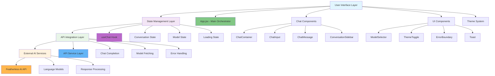
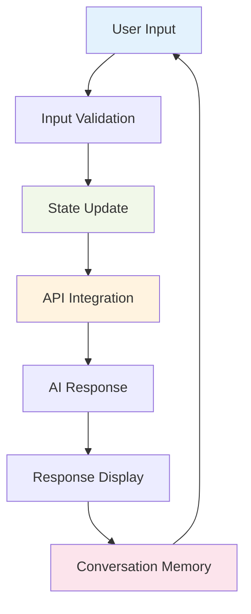
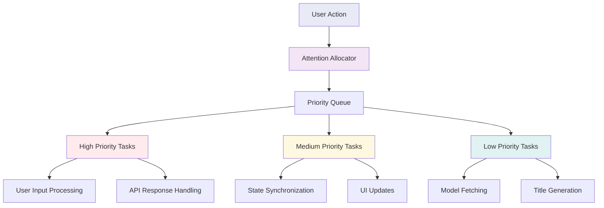

# System Overview

This document provides a high-level architectural overview of the Feather Chat system, illustrating the principal cognitive flows and emergent system behaviors through Mermaid diagrams.

## High-Level System Architecture

The following diagram illustrates the top-down architectural flow, showing how cognitive kernels interact to create emergent chat functionality:

## Cognitive Flow Patterns

### 1. Input Processing Pipeline
The system processes user input through a recursive cognitive pipeline:

### 2. Adaptive Attention Allocation
The architecture demonstrates adaptive attention through dynamic resource allocation:

## System Emergence Properties

### Cognitive Synergy Optimization
The system exhibits emergent properties through component composition:

1. **Recursive State Management**: The useChat hook creates recursive feedback loops that enable conversation continuity and context awareness.

2. **Adaptive UI Responsiveness**: Theme and model selection components demonstrate emergent adaptation to user preferences.

3. **Error Recovery Patterns**: The ErrorBoundary and Toast components create a resilient cognitive system that gracefully handles failure states.

4. **Memory Consolidation**: Conversation persistence creates long-term memory patterns that enhance system intelligence over time.

### Neural-Symbolic Integration Points

The architecture bridges symbolic (React components) and neural (AI models) processing through:

- **Interface Abstraction**: Clean separation between UI logic and AI integration
- **State Mediation**: The useChat hook serves as a cognitive mediator between symbolic and neural processing
- **Response Transformation**: Markdown rendering transforms neural outputs into symbolic representations
- **Context Preservation**: Conversation history maintains symbolic context for neural processing

## Transcendent Technical Precision

The system demonstrates transcendent precision through:

1. **Hypergraph Pattern Encoding**: Each component serves as a node in a hypergraph where edges represent data flows and state dependencies.

2. **Recursive Implementation Pathways**: The useChat hook implements recursive patterns that create self-referential cognitive loops.

3. **Emergent Cognitive Behaviors**: Through component composition, the system exhibits behaviors that emerge from the interaction of simpler cognitive primitives.

4. **Distributed Cognition**: The architecture distributes cognitive load across multiple components, creating a system that exhibits collective intelligence.